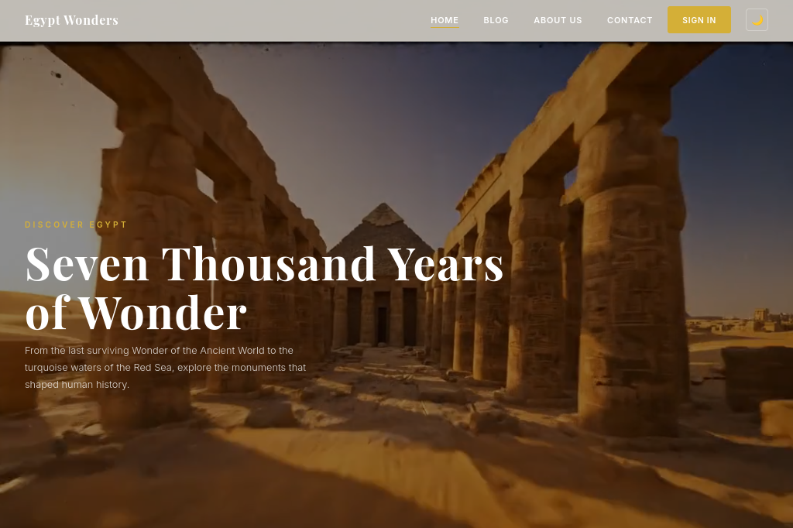
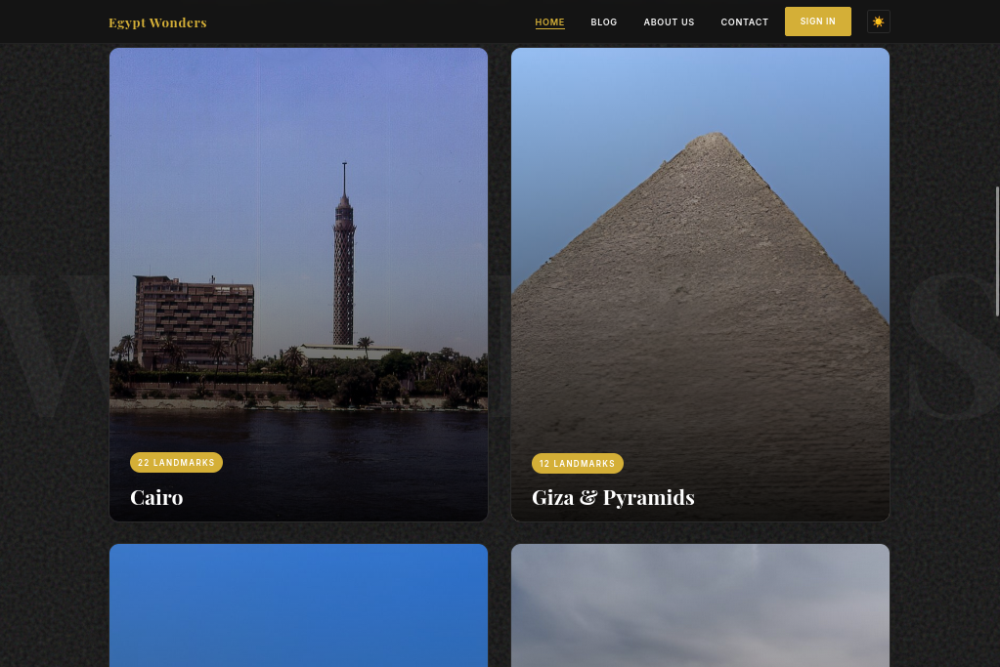
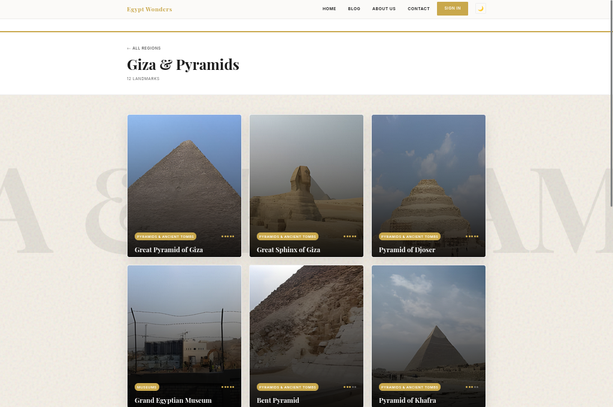
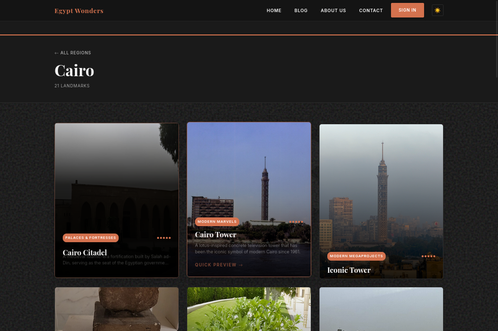
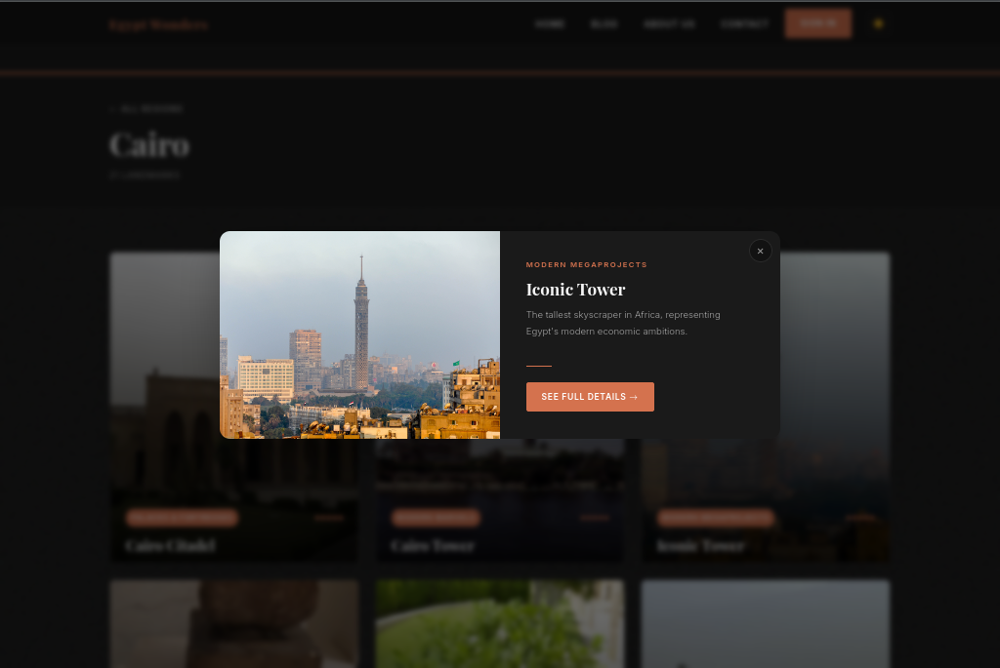
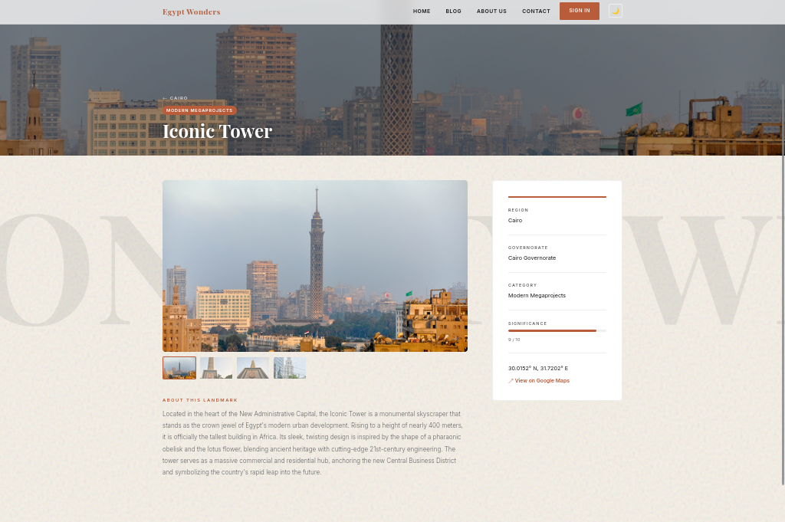

# 🏛️ Egypt Wonders

> *A cinematic travel discovery website showcasing Egypt's most remarkable landmarks across 9 geographic regions — built with pure HTML5, CSS3, and vanilla JavaScript. Zero frameworks. Zero build tools.*


---



---

## ✨ Features

- **Cinematic hero** — fullscreen autoplay video with staggered fade-in text
- **9 Region cards** — hover reveals description, image zooms in
- **Dynamic landmark grid** — 90+ landmarks loaded from JSON via `fetch()`
- **Quick preview modal** — native `<dialog>`, no library needed
- **Landmark detail page** — image gallery, sticky sidebar, breadcrumb nav
- **Dark mode** — one-click toggle, persisted in `localStorage`
- **Desert paper texture** — SVG noise background, pure CSS, zero image files
- **Scroll reveal animations** — fade-in via `IntersectionObserver`
- **Per-region accent colors** — Cairo gets terracotta, Alexandria gets Mediterranean blue, etc.

---

## 🖼️ Screenshots

<table>
  <tr>
    <td><strong>Home — Region Cards</strong></td>
    <td><strong>Region Page — Light Mode</strong></td>
  </tr>
  <tr>
    <td></td>
    <td></td>
  </tr>
  <tr>
    <td><strong>Region Page — Dark Mode</strong></td>
    <td><strong>Quick Preview Modal</strong></td>
  </tr>
  <tr>
    <td></td>
    <td></td>
  </tr>
  <tr>
    <td colspan="2" align="center"><strong>Landmark Detail Page</strong></td>
  </tr>
  <tr>
    <td colspan="2" align="center"></td>
  </tr>
</table>

---

## 📄 Pages

| Page | File | Description |
|------|------|-------------|
| Home | `index.html` | Hero video + 9 region cards — zero JS required to display |
| Region | `region.html` | Dynamic landmark grid, loaded via `?id=` query param |
| Landmark | `landmark.html` | Gallery, sticky sidebar, breadcrumbs |
| Blog | `blog.html` | Static editorial layout |
| Contact | `contact.html` | Static contact form |
| Auth | `auth.html` | Sign in / sign up |

---

## 🗺️ Regions

| Region | Landmarks | Highlights |
|--------|-----------|------------|
| Cairo | 22 | Cairo Tower, Al-Azhar Mosque, Egyptian Museum |
| Giza & Pyramids | 12 | Great Pyramid, Great Sphinx, Solar Boat Museum |
| Luxor & Thebes | 12 | Karnak Temple, Valley of the Kings, Hatshepsut |
| Aswan & Nubia | 10 | Temple of Philae, Abu Simbel, High Dam |
| Sinai & Red Sea | 10 | St. Catherine's Monastery, Mount Sinai |
| Alexandria | 9 | Citadel of Qaitbay, Bibliotheca Alexandrina |
| Western Desert | 9 | Temple of Hibis, White Desert, Siwa Oasis |
| Upper Egypt | 5 | Temple of Seti I, Temple of Dendera |

---

## 🎨 Design System

| Token | Light | Dark | Purpose |
|-------|-------|------|---------|
| `--bg-body` | `#F4EFE6` | `#121212` | Page background with SVG noise texture |
| `--accent` | `#D4AF37` | `#D4AF37` | Metallic gold — buttons, tags, active links |
| `--font-heading` | Playfair Display | — | Editorial serif |
| `--font-body` | Inter | — | Readable sans-serif |

Each region overrides `--accent` automatically via `data-region` — Cairo uses terracotta `#B85C3A`, Alexandria uses Mediterranean blue `#2266AA`.

---

## 🛠️ Tech Stack

| Layer | Technology |
|-------|------------|
| Structure | HTML5 — semantic elements, `<dialog>`, `aria-*` |
| Styling | CSS3 — custom properties, Grid, Flexbox, keyframes |
| Logic | Vanilla ES6+ — `fetch()`, `IntersectionObserver`, `localStorage` |
| Data | JSON — `regions.json` + `landmarks.json`, no database |
| Fonts | Google Fonts — Playfair Display + Inter |

---

## 🚀 Running Locally

> Requires a local server — browsers block `fetch()` on `file://` URLs.

```bash
git clone https://github.com/Mahmoud12344/Egypt-Wonders-web.git
cd Egypt-Wonders-web
python3 -m http.server 8000
```

Then open **http://localhost:8000**

---

## 📁 Structure

```
├── index.html              # Home — hero + region cards
├── region.html             # Dynamic landmark grid (via ?id=)
├── landmark.html           # Gallery, sidebar, breadcrumbs
├── blog.html
├── contact.html
├── auth.html
├── css/
│   ├── global.css          # Design system, dark mode, nav
│   ├── home.css
│   ├── landmarks-grid.css
│   └── landmark.css
├── js/
│   ├── nav.js              # Dark mode toggle, active links
│   ├── auth.js             # Auth state, sign-in/greeting swap
│   ├── region.js           # Fetch + render landmarks, modal
│   ├── landmark.js         # Fetch + render detail page
│   └── reveal.js           # Scroll animations
└── assets/
    ├── data/               # regions.json, landmarks.json
    ├── images/
    └── videos/hero-bg.mp4
```

---

## 📜 License

This project is a **Fourth Semester Web Development project** — 2026.

---

<p align="center">Egypt Wonders · Fourth Semester Web Project · 2026</p>